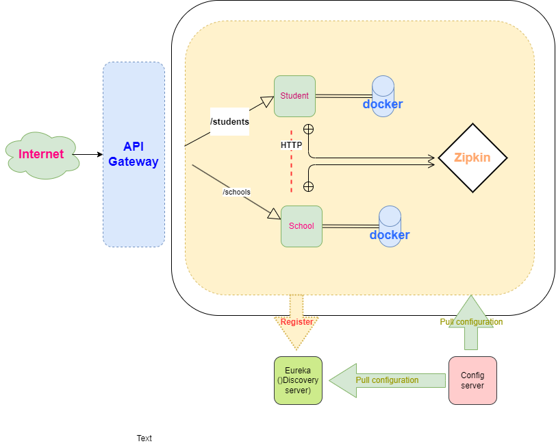
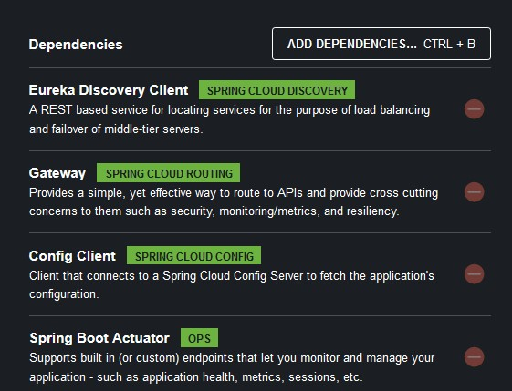
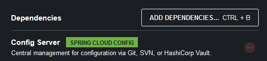
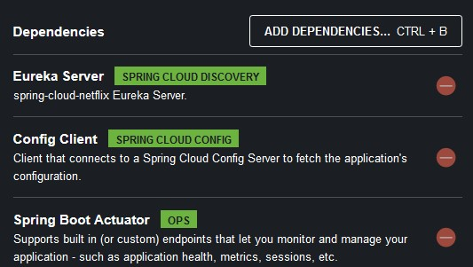
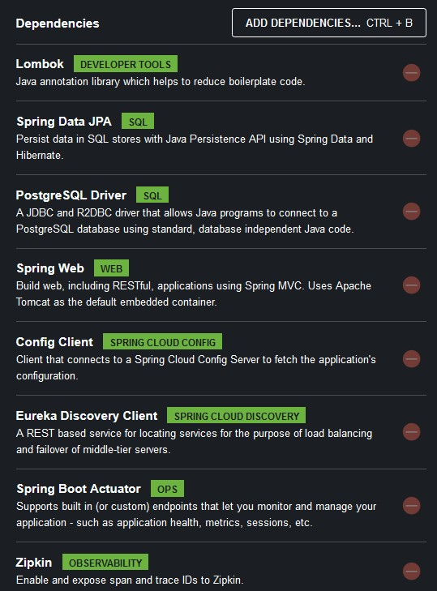
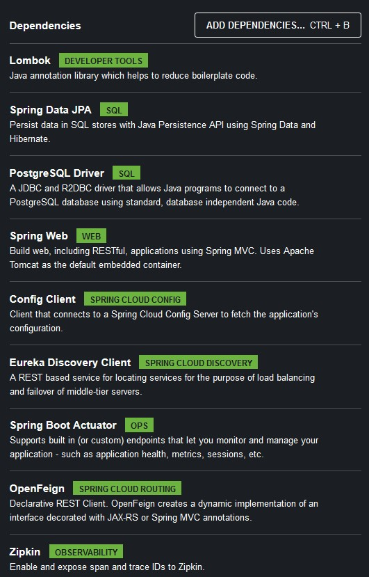

# Microservices Demo Project

This repository contains a project showcasing microservices architecture and implementation. The project consists of an API Gateway, Config Server,
Discovery Server, and two microservices: Student and School.

### Prerequisites

- Java Development Kit (JDK) 17 or later
- Maven
- Docker (optional, for containerization)

### Installation

## Project Components

### API Gateway

The API Gateway serves as the single entry point for all client requests, managing and routing them to the appropriate
microservices.

### Config Server

The Config Server centralizes configuration management for all microservices, simplifying application maintenance and
consistency across environments.

### Discovery Server

The Discovery Server provides service registration and discovery, enabling seamless service-to-service communication
within the microservices ecosystem.

### Student Microservice

The Student Microservice is responsible for managing student-related data and operations, such as adding, updating, and
retrieving student records.

### School Microservice

The School Microservice manages school-related data and operations, including adding, updating, and retrieving school
records.

## Inter-Service Communication

### Using OpenFeign

This project demonstrates inter-service communication using OpenFeign, a declarative REST client that simplifies
service-to-service communication within the microservices ecosystem.

## Distributed Tracing

### Using Zipkin

The project showcases the use of Zipkin for distributed tracing, enhancing application observability and enabling the
visualization and troubleshooting of latency issues.
 
 

 

 
